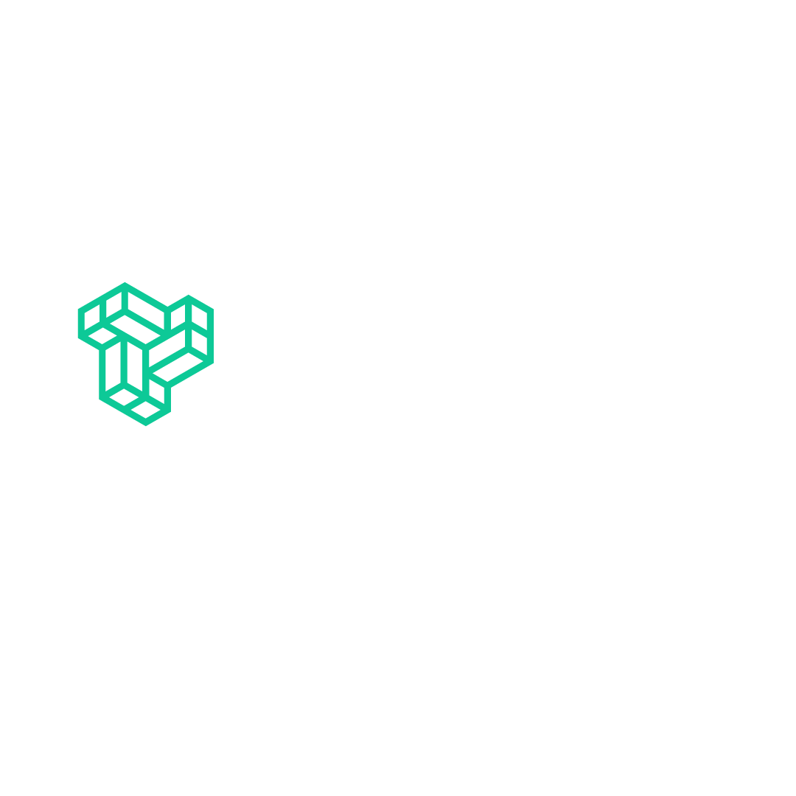

# 🚀 Cursor Prompt Sync

**Extension for VS Code - AI Prompt Analytics & PostgreSQL Integration**

Transform your AI development workflow with the ultimate toolkit for automated Cursor prompt collection and PostgreSQL storage. Seamlessly extract, process, and sync your Cursor IDE activity to enterprise-grade PostgreSQL databases with zero manual configuration required.

## ✨ Production-Grade Features

🎯 **Enterprise-Ready Auto-Detection**: Zero-configuration setup with intelligent database discovery across all platforms  
📊 **Real-Time Analytics Pipeline**: Automated extraction and processing of Cursor development activity  
⚡ **High-Performance Scheduling**: Lightning-fast background sync with configurable intervals (minutes to hours)  
🔄 **Smart Incremental Processing**: Only syncs new data since last update for optimal performance  
️ **Error-Resilient Architecture**: Robust error handling and intelligent fallbacks for production environments  
📁 **Multi-Platform Database Discovery**: Automatically locates Cursor databases on Windows, macOS, and Linux  
🗄️ **PostgreSQL Integration**: Direct integration with PostgreSQL for scalable data storage  
🔒 **Secure Data Pipeline**: Read-only database access with encrypted cloud transmission  
📈 **Productivity Analytics**: Complete archive of development patterns and AI interaction history

## 🚀 Cross-Platform Installation Guide

### 📝 **VS Code Installation**

#### **🪟 Windows (VS Code)**
```powershell
# Method 1: VS Code Marketplace (Recommended)
ext install YorkIE.cursor-prompt-sync

# Method 2: Command Line
code --install-extension YorkIE.cursor-prompt-sync

# Method 3: PowerShell with Admin Rights
Start-Process powershell -Verb runAs
code --install-extension YorkIE.cursor-prompt-sync
```

#### **🍎 macOS (VS Code)**
```bash
# Method 1: VS Code Marketplace (Recommended)
ext install YorkIE.cursor-prompt-sync

# Method 2: Terminal Installation
code --install-extension YorkIE.cursor-prompt-sync

# Method 3: Homebrew Installation
brew install --cask visual-studio-code
code --install-extension YorkIE.cursor-prompt-sync
```

#### **🐧 Ubuntu/Linux (VS Code)**
```bash
# Method 1: VS Code Marketplace (Recommended)
ext install YorkIE.cursor-prompt-sync

# Method 2: APT Package Manager (if VS Code installed via APT)
code --install-extension YorkIE.cursor-prompt-sync

# Method 3: Snap Installation (if VS Code installed via Snap)
snap run code --install-extension YorkIE.cursor-prompt-sync

# Method 4: Manual Installation
wget https://marketplace.visualstudio.com/_apis/public/gallery/publishers/YorkIE/vsextensions/cursor-prompt-sync/latest/vspackage -O cursor-prompt-sync.vsix
code --install-extension cursor-prompt-sync.vsix
```

## 🎮 Universal Keyboard Shortcuts

### **VS Code Shortcuts**
| Platform | Command Palette | Quick Launch | Extension Panel |
|----------|----------------|--------------|-----------------|
| **Windows** | `Ctrl+Shift+P` | `Ctrl+Shift+A` | `Ctrl+Shift+X` |
| **macOS** | `Cmd+Shift+P` | `Cmd+Shift+A` | `Cmd+Shift+X` |
| **Linux** | `Ctrl+Shift+P` | `Ctrl+Shift+A` | `Ctrl+Shift+X` |

### **Additional Shortcuts**
| Platform | Show Status | Database Info |
|----------|-------------|---------------|
| **Windows** | `Ctrl+Shift+T` | `Ctrl+Shift+D` |
| **macOS** | `Cmd+Shift+T` | `Cmd+Shift+D` |
| **Linux** | `Ctrl+Shift+T` | `Ctrl+Shift+D` |

## 🚀 Power User Workflow

### **For PostgreSQL Integration**
1. **🎯 Launch Setup**: 
   - **Windows/Linux**: `Ctrl+Shift+P` → `Cursor Prompt Sync: Auto-Setup PostgreSQL Connection`
   - **macOS**: `Cmd+Shift+P` → `Cursor Prompt Sync: Auto-Setup PostgreSQL Connection`

2. **🔑 One-Click Configuration**: Extension automatically configures with sensible defaults
3. **🔄 Auto-Sync**: Start the auto-scheduler for continuous data synchronization
4. **📊 Monitor Activity**: Track sync status in real-time
5. **💻 Analyze Data**: Access your prompt analytics in PostgreSQL

### **For Local Development**
1. **🎯 Launch Command**: 
   - **Windows/Linux**: `Ctrl+Shift+P` → `Cursor Prompt Sync: Configure Auto-Scheduler`
   - **macOS**: `Cmd+Shift+P` → `Cursor Prompt Sync: Configure Auto-Scheduler`

2. **📋 Set Interval**: Configure sync frequency (minutes to hours)
3. **🔄 Start Scheduler**: Begin automated prompt collection
4. **💻 Monitor Progress**: Real-time status updates and analytics

## 🎯 Why Choose Cursor Prompt Sync?

### 🏢 **Production-Ready Architecture**
- Built for enterprise development teams
- Cross-platform compatibility (Windows, macOS, Linux)
- Universal support for VS Code
- Scalable PostgreSQL backend architecture

### 🛠️ **Developer Experience First**
- Zero configuration required - works out of the box
- Intuitive UI with smart defaults
- Seamless integration with existing VS Code workflows
- Native performance on all operating systems

### 🔒 **Enterprise Security**
- Read-only access to Cursor database (no modifications)
- Secure encrypted connections only
- Complete user control over data collection and storage
- Compliant with enterprise security policies

## 📋 System Requirements

### **Minimum Requirements**
| Component | Windows | macOS | Ubuntu/Linux |
|-----------|---------|-------|--------------|
| **VS Code** | 1.74.0+ | 1.74.0+ | 1.74.0+ |
| **Cursor IDE** | Any version | Any version | Any version |
| **OS Version** | Windows 10+ | macOS 10.15+ | Ubuntu 20.04+ |
| **RAM** | 4GB | 4GB | 4GB |
| **Storage** | 50MB+ | 50MB+ | 50MB+ |
| **Network** | Internet for PostgreSQL | Internet for PostgreSQL | Internet for PostgreSQL |

### **Recommended for Optimal Performance**
| Component | Windows | macOS | Ubuntu/Linux |
|-----------|---------|-------|--------------|
| **VS Code** | Latest | Latest | Latest |
| **Cursor IDE** | Latest | Latest | Latest |
| **OS Version** | Windows 11 | macOS 13+ | Ubuntu 22.04+ |
| **RAM** | 8GB+ | 8GB+ | 8GB+ |
| **Storage** | 500MB+ SSD | 500MB+ SSD | 500MB+ SSD |

## 🏗️ Intelligent Data Pipeline

The extension creates a production-optimized analytics workflow across all platforms:

### **🪟 Windows Data Flow**
```
📊 Cursor IDE Activity
    ↓ (Real-time capture)
🗄️ Local SQLite Database (state.vscdb)
    ↓ (Auto-detection & extraction)
⚡ Smart Processing Engine
    ↓ (Incremental sync)
🐘 PostgreSQL Database
    ↓ (Analytics & reporting)
📈 Development Insights
```

### **🍎 macOS Data Flow**
```
📊 Cursor IDE Activity
    ↓ (Real-time capture)
🗄️ Local SQLite Database (state.vscdb)
    ↓ (Auto-detection & extraction)
⚡ Smart Processing Engine
    ↓ (Incremental sync)
🐘 PostgreSQL Database
    ↓ (Analytics & reporting)
📈 Development Insights
```

### **🐧 Linux Data Flow**
```
📊 Cursor IDE Activity
    ↓ (Real-time capture)
🗄️ Local SQLite Database (state.vscdb)
    ↓ (Auto-detection & extraction)
⚡ Smart Processing Engine
    ↓ (Incremental sync)
🐘 PostgreSQL Database
    ↓ (Analytics & reporting)
📈 Development Insights
```

## 🎛️ **Command Center**

### **Core Commands**
| Command | Keybinding | Purpose |
|---------|------------|---------|
| **Auto-Setup PostgreSQL Connection** | - | One-click PostgreSQL configuration |
| **Toggle Auto-Scheduler** | `Ctrl+Shift+A` | Start/stop automated data collection |
| **Show Auto-Scheduler Status** | `Ctrl+Shift+T` | Real-time scheduler status and statistics |
| **Configure Auto-Scheduler Interval** | - | Set sync frequency (minutes to hours) |
| **Configure PostgreSQL for Auto-Scheduler** | - | Enterprise database setup |
| **Start Auto-Scheduler** | - | Begin automated prompt collection |
| **Stop Auto-Scheduler** | - | Halt data collection |

### **Management Commands**
| Command | Keybinding | Purpose |
|---------|------------|---------|
| **Get Last Datapoint from PostgreSQL** | - | Verify latest synced data |
| **Configure User ID** | - | Custom user identification management |
| **Configure Local Database Path** | - | Manual database path configuration |
| **Switch PostgreSQL Database/Table** | - | Change target database or table |
| **Show Database Configuration** | `Ctrl+Shift+D` | Current database configuration details |

## 🛠️ **PostgreSQL Configuration**

### **Automatic Setup (Recommended)**
The extension uses intelligent defaults for immediate productivity:

```json
{
  "cursorSqlRunner.postgresHost": "your_host_ip",
  "cursorSqlRunner.postgresPort": 5432,
  "cursorSqlRunner.postgresDatabase": "cursor_analytics",
  "cursorSqlRunner.postgresUser": "postgres",
  "cursorSqlRunner.postgresTableName": "cursor_query_results"
}
```

### **Manual Configuration (Advanced)**
For enterprise environments, configure through VS Code settings:

```json
{
  "cursorSqlRunner.databasePath": "",                     // Auto-detected (leave empty)
  "cursorSqlRunner.outputDirectory": "./cursor-query-results", // Local backup directory
  "cursorSqlRunner.postgresHost": "your-postgres-host",   // Database server host
  "cursorSqlRunner.postgresPort": 5432,                   // Database server port
  "cursorSqlRunner.postgresDatabase": "cursor_analytics", // Target database name
  "cursorSqlRunner.postgresUser": "postgres",             // Database username
  "cursorSqlRunner.postgresPassword": "",                 // Database password
  "cursorSqlRunner.postgresTableName": "cursor_query_results", // Target table name
  "cursorSqlRunner.autoSchedulerInterval": 60,            // Collection interval (minutes)
  "cursorSqlRunner.userId": ""                             // Auto-detected from system
}
```

### **🗄️ PostgreSQL Database Schema**
The extension automatically creates this optimized table structure:

```sql
-- Simplified 5-column schema for optimal performance
CREATE TABLE IF NOT EXISTS cursor_query_results (
  id BIGSERIAL PRIMARY KEY,
  created_at TIMESTAMPTZ DEFAULT TIMEZONE('utc'::text, NOW()),
  timestamp TEXT NOT NULL,
  prompt TEXT NOT NULL,
  user_id TEXT NOT NULL
);

-- Performance indexes
CREATE INDEX IF NOT EXISTS idx_cursor_query_results_created_at ON cursor_query_results(created_at);
CREATE INDEX IF NOT EXISTS idx_cursor_query_results_timestamp ON cursor_query_results(timestamp);
CREATE INDEX IF NOT EXISTS idx_cursor_query_results_user_id ON cursor_query_results(user_id);
```

## 🎯 **Auto-Detection Features**

### **Database Path Detection**
- **Windows**: `C:\Users\{username}\AppData\Roaming\Cursor\User\globalStorage\state.vscdb`
- **macOS**: `~/Library/Application Support/Cursor/User/globalStorage/state.vscdb`
- **Linux**: `~/.config/Cursor/User/globalStorage/state.vscdb`

### **User ID Detection**
- Queries Cursor database for cached email (`cursorAuth/cachedEmail`)
- Uses your actual Cursor login email as the User ID for PostgreSQL records
- More accurate than system username - uses your actual Cursor account
- Falls back to `local_user` if email not found in database

### **Smart Notifications**
- **Success**: Shows notification when database is auto-detected
- **Configuration**: Prompts for minimal required input (password only)
- **All activity logged**: Check "Cursor Analytics - PostgreSQL" output channel

## 🆘 Support & Community

### **Platform-Specific Support**
- **🪟 Windows**: [Windows Issues](https://github.com/Pushkar111/cursor-prompt-extension/issues?q=is%3Aissue+is%3Aopen+label%3Awindows)
- **🍎 macOS**: [macOS Issues](https://github.com/Pushkar111/cursor-prompt-extension/issues?q=is%3Aissue+is%3Aopen+label%3Amacos)
- **🐧 Linux**: [Linux Issues](https://github.com/Pushkar111/cursor-prompt-extension/issues?q=is%3Aissue+is%3Aopen+label%3Alinux)

### **Feature-Specific Support**
- **🐘 PostgreSQL**: [PostgreSQL Issues](https://github.com/Pushkar111/cursor-prompt-extension/issues?q=is%3Aissue+is%3Aopen+label%3Apostgresql)
- **� Analytics**: [Analytics Issues](https://github.com/Pushkar111/cursor-prompt-extension/issues?q=is%3Aissue+is%3Aopen+label%3Aanalytics)

### **Need Help?**
- 📧 **Enterprise Support**: support@york.ie
- 💬 **Community Discord**: [Join our community](https://discord.gg/yorkIE)
- 🐛 **Bug Reports**: [GitHub Issues](https://github.com/Pushkar111/cursor-prompt-extension/issues)
- � **Feature Requests**: [GitHub Discussions](https://github.com/Pushkar111/cursor-prompt-extension/discussions)

## 🔧 Troubleshooting

### **Auto-Detection Issues**
If auto-detection isn't working:
1. **Check Output Channel**: View "Cursor Analytics - PostgreSQL" for detailed logs
2. **Manual Override**: Use "Configure Local Database Path" command
3. **Username Issues**: Use "Configure User ID" command for custom User ID
4. **Restart Extension**: Reload VS Code window to re-trigger auto-detection

### **PostgreSQL Connection Issues**
If the extension can't connect to PostgreSQL:
1. Verify PostgreSQL is running and accessible
2. Check host, port, database, and credentials
3. Ensure PostgreSQL accepts connections from your IP
4. Use the "Show Database Configuration" command to verify settings
5. Check firewall and security group configurations

### **Database Not Found**
If the extension can't find your Cursor database:
1. Ensure Cursor IDE is installed and has been used at least once
2. Check that the database file exists in standard locations
3. Use the "Configure Local Database Path" command for manual setup
4. Verify file permissions (extension needs read access)

### **Sync Issues**
- Ensure your PostgreSQL credentials are correct
- Check that the target table exists and is accessible
- Verify you have write permissions on the database
- Monitor the auto-scheduler status for error messages

## 📄 License

This project is licensed under the MIT License - see the [LICENSE](LICENSE) file for details.

## 🙏 Acknowledgments & Credits

- **[Pushkar Modi](https://www.linkedin.com/in/pushkarmodi111/)** - York IE Intern 2025-26 batch  
- **[Parth Raninga](https://www.linkedin.com/in/parth-raninga-4985a920a/)** - York IE Intern 2025-26 batch
- **[Vishal Prajapati](https://www.linkedin.com/in/vishal-prajapati-56a233290/)** - York IE Intern 2025-26 batch
- **[Cursor Team](https://cursor.sh)** - For revolutionizing AI-powered development
- **[VS Code Team](https://code.visualstudio.com)** - For the exceptional extensibility platform
- **[PostgreSQL Team](https://www.postgresql.org)** - For the world's most advanced open source database

---

<div align="center">



*Made with ❤️ by [York.ie](https://york.ie)*

*Play the long game*

[](https://code.visualstudio.com)
[](https://www.postgresql.org)

[](https://www.microsoft.com/windows)
[](https://www.apple.com/macos)
[](https://www.linux.org)

</div>